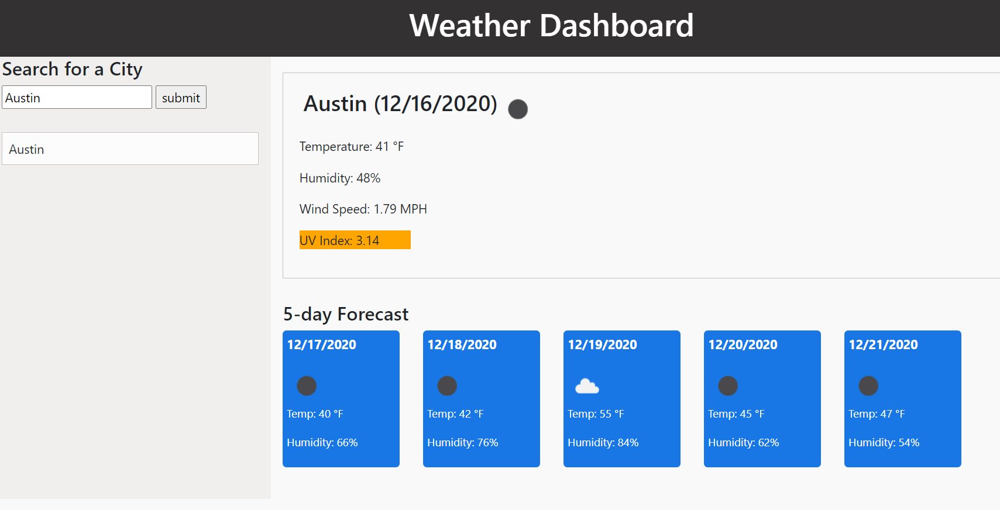

## AUTHOR: Pranitha Maganty
## PROJECT: Weather Dashboard
### DESCRIPTION: This app allows user to see weather statistics for a city of their choice.
### Github URL: https://pmaganty.github.io/weather_dashboard/

### Files:
+ index.html
+ style.css
+ script.js
+ moment.js
 
### Directions for user: 
+ Enter city name into search box. Press search to get info about the city.
+ You will see current weather conditions immediately to the right. 
+ The UV index will be highlied green if the UV value is low, orange if moderate, and red if high.
+ Underneath that, you will see a weather forecast for the next 5 days. 
+ Every city you enter will show as a list on the left hand side. If you want to view the weather
+ information for that city again, click on it and it will move to the top of the list while displaying
+ the relevant weather info.